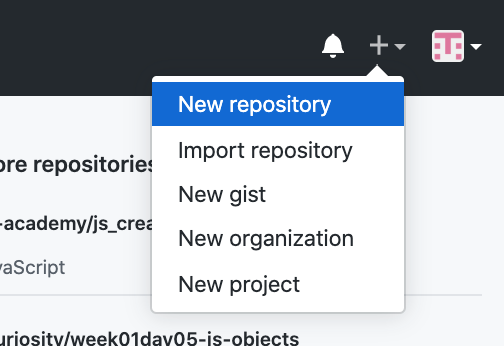

# How to deploy your website on github : 
## STEP 1: Create Repository
#     

## STEP 2: Name it as your project name (preferred) 
#   

## STEP 3:Make sure it's a public repository
   #   

      
## STEP 4: Click Create and this page will show
  # 

## STEP 5: Go to your file using the Terminal
- `cd fileName` // Go inside the project file. 
- `echo "# Project-name-sara" >> README.md` // To create readme file
- `git init` // To initialize the Repository
- `git remote add origin https://github.com/daghustani/Project-name-Sara.git` // To connect the local with github
- `git add .` // To add you files into github
- `git commit -m "your message"` // To take screen of what you have
- `git push -u origin master` // Push to the Repository

 # 
    
## STEP 6: Open your repository in github
 # 

## STEP 7: Go to settings. 
#        

## STEP 8: Scroll down to GitHub Pages where by default source in "None" 
#   

## STEP 9: Change the source to be "master branch". 
 #        
    
## STEP 10: Scroll down to GitHub Pages and Click the link and now you can see your website.
 # 
     
